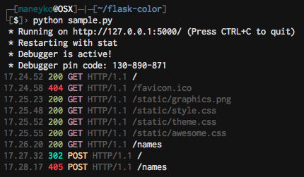

Flask-Color
===========



flask-color is an extension for Flask that improves the built-in web server
with colors when debugging.

Installing
----------

You can install this using pip.

```
$ pip install git+git://github.com/maneyko/flask-color
```

How to use
----------

There's an example of use in sample.py. Add two lines to your code:

```python
# Import this extension
import flask_color

# Initialize extension with your app.
flask_color.init_app(app)
```

Flask configuration *DEBUG* must be True for this extension to function. You
can override this by setting *COLOR_ALWAYS_ON* to true.

Configuration
-------------

- *COLOR_ALWAYS_ON*: Force extension on even if not in DEBUG mode
- *COLOR_PATTERN_GRAY*: Regular expression that matches static file requests
  (these requests are marked with gray color)
- *COLOR_PATTERN_HIDE*: Hides requests that match this regular expression.
